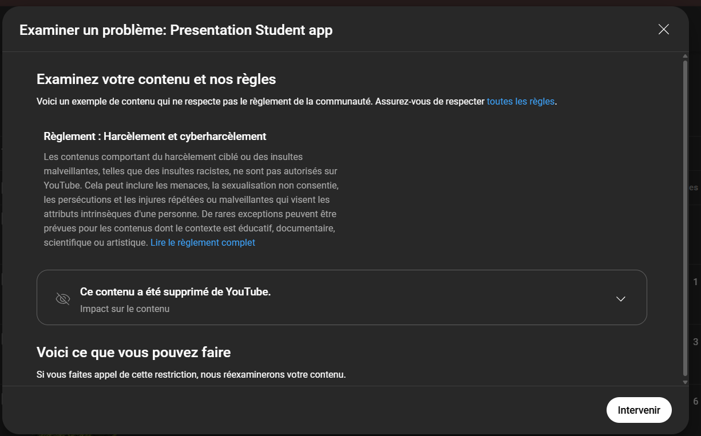

[](https://classroom.github.com/a/j-otaqSD)

# 📚 Student Management App

Application web complète de gestion des étudiants, cours et notes, réalisée dans le cadre d'un projet universitaire. Elle intègre l'authentification via OAuth2/SSO Google, des dashboards dynamiques par rôle, la génération de bulletins, ainsi qu’un déploiement cloud avec Docker et CI/CD.

## ✨ Fonctionnalités

### 🧩 Module 0 - Fonctionnalités de base
- Gestion des entités : étudiants, cours, notes
- Synchronisation avec une API Node.js
- Interface utilisateur React avec Material UI (mode clair/sombre)

### 🔐 Module 1 - Authentification & Rôles
- Authentification sécurisée via OAuth2
- Authentification SSO via Google
- Gestion des rôles :
  - **ADMIN** : accès complet, gestion des comptes utilisateurs
  - **SCOLARITE** : gestion des cours, notes et profils étudiants
  - **STUDENT** : accès personnel aux notes et statistiques

Une fois connecté :
- Un administrateur a un accès complet en lecture et écriture sur toutes les données.
- Un membre de la scolarité peut gérer uniquement les cours, étudiants et notes.
- Un étudiant peut consulter uniquement ses propres données et statistiques.

### 📊 Module 2 - Dashboards statistiques
- **Administrateur** : vue globale sur toutes les entités
- **Scolarité** : vue limitée aux données académiques
- **Étudiant** : vue personnelle sur son dossier

### 🚀 Module 3 - Conteneurisation & Déploiement
- Dockerisation du frontend (React) et backend (Node.js)
- Pipeline CI/CD
  - **Backend** : déployé via Render [https://student-management-backend-v2.onrender.com/](https://student-management-backend-v2.onrender.com/)
  - **Frontend** : déployé via Vercel [https://front-student-alpha.vercel.app/](https://front-student-alpha.vercel.app/)
- Utilisation de GitHub Actions pour automatiser le déploiement
## ⚠️ Remarque sur le dépôt du projet

Le code source de ce projet est également disponible dans un autre dépôt public, car ce dépôt utilisés lors du développement n' est pas publics.

Le code reste **identique** dans ce dépôt public.
## 🔑 Comptes de test

### Admin  
- Email : achilleaubinfanomezantsoa@gmail.com  
- Mot de passe : achilleaubin

### Scolarité  
- Email : hajaina@gmail.com  
- Mot de passe : hajaina

### Student  
- Email : onjambola9@gmail.com  
- Mot de passe : onja

## 🖥️ Technologies utilisées

- **Frontend** : React + Material UI
- **Backend** : Node.js + Express
- **Base de données** : MongoDB
- **Authentification** : OAuth2, Google SSO
- **Conteneurisation** : Docker
- **Déploiement** : Vercel (frontend), Render (backend)
- **CI/CD** : GitHub Actions
- **Formats de bulletin** : Texte, PDF, CSV
- **Emailing** : Envoi bulletin par mail

## ⚙️ Installation

### Prérequis

- Node.js ≥ 16.x
- Docker
- Git

### Clonage du projet

```bash
git clone https://github.com/AchilleAubi/student-management-backend-v2.git
cd student-management-backend-v2

### Commande pour la création de l'image Docker
```docker build -t student-backend .```

### Commande pour lancer le container
```docker run -d -p 3000:3000 --name student-backend student-backend```

```
## 👨‍💻 Contributeurs

- 7 - ANDRIANIRIMANJAKA Onja Mbola
- 11 - ANDRIATSITOHAINA Lahatra Mamy Hajaina  
- 14 - FANOMEZANTSOA Achille   
- 20  
- 26  

## 🎥 Vidéo de démonstration

🎬 [Lien vers la vidéo de démo sur youtube](https://youtu.be/-dIEhgN5Cr0)

⚠️ La vidéo a été temporairement retirée par YouTube pour vérification suite à une suspicion de non-respect du règlement *(voir image ci-dessous)*.  
Nous avons fait appel de cette décision.  
En attendant, vous pouvez consulter la **version alternative hébergée sur Dailymotion** :

🔗 [Voir la vidéo sur Dailymotion](https://dai.ly/k1JeSLz9Ai6aGIDabGI)



